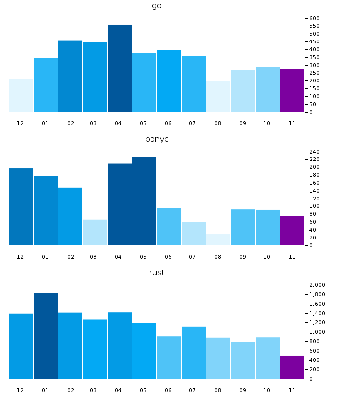

open-source-stats
=================

This is a proof of concept for a website dedicated to presenting statistics on open source projects and their contributors.

This is an early work in progress.

license
-------

This works is licensed under the GPL version 3

demo
----

`make view` will open a browser with the current demo

full demo
----

If you want to see a full length demo including git cloning, data generation, and display you can run `make demo`

    chris@Ox1b open-source-stats(master)-> make demo
    ./scripts/demo.sh
    db 'oos.sqlite' already exists, deleting
    creating database 'oos.sqlite'
    success
    name is 'github.com_CausalityLtd_ponyc.git'
    fetching to 'repos/github.com_CausalityLtd_ponyc.git'
    name is 'github.com_rust-lang_rust.git'
    fetching to 'repos/github.com_rust-lang_rust.git'
    output generated to `site/index.html`, attempting to open in browser
    Created new window in existing browser session.

this will create a new db with a fresh schema, clone/update the testing project (here we use ponyc)
it then generates the statistics, and then opens the testing site in a browser showing those generated stats.

this will then open your browser of choice showing a page with the colouring graphs along with the graphs for the current
testing projects.

colour chart
------------

HELP WANTED

I am not a designer...

I want to make the graph bars colours to show percentages,
I also would like the right-most bar to be coloured to show it being 'in progress'

if you run `make generate` your browser should open to a page showing

These colours are currently based on the 'light blue' palette from http://www.google.com/design/spec/style/color.html#color-color-palette

the section below `colouring values` includes instructions on how to play with these colours

colouring values
----------------

HELP WANTED

the directory `palettes/` contains a list of possible palettes

    chris@Ox1b open-source-stats(master)-> ls -1 palettes/
    google-blue.hex
    google-light-blue.hex
    old-blue.rgb

the default palette is currently `google-light-blue.hex`

you can specify which ever palette you want by running

    ./scripts/gen_colour_palette.py palettes/google-blue.hex

you can then view this via `make view`

you can always get back to the default via

    make default-palette

deps
----

 * python3
 * sqlite3
 * libgit2
 * python cffi
 * pygit2

